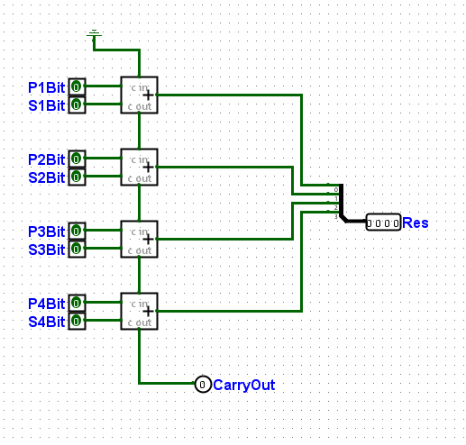
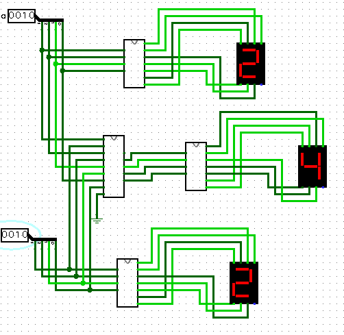

# Arquitetura de Computadores 2
## Autor
- Rafael Grossi
## ATIVIDADE 1: Construção de Somadores
### Identificação de Componentes
* Uma porta **XOR** para calcular a SOMA (S).
* Uma porta **AND (E)** para calcular o Carry-Out (Cout).
* **74LS86 (ou 7486):** Contém quatro portas XOR de duas entradas.
* **74LS08 (ou 7408):** Contém quatro portas AND de duas entradas.
* **VCC:** É o pino de alimentação positiva, geralmente conectado a +5V, é o **pino 14**.
* **GND:** É o pino de aterramento (0V), é o **pino 7**.
* **Entradas e Saídas:** 74LS86, os pinos 1 e 2 são entradas da primeira porta XOR, e o pino 3 é a sua saída.

### Pergunta 1
**O que acontece se um dos terminais de entrada de uma porta lógica não estiver conectado em 0 ou 1 (flutuando)?**

Quando uma entrada de uma porta lógica TTL (como a série 74xx) é deixada "flutuando" (desconectada), ela se comporta como se estivesse em nível lógico alto (1). Isso ocorre devido à configuração interna dos transistores. No entanto, a entrada torna-se passível a ruídos elétricos, que podem causar uma interpretação incorreta do nível lógico e levar a um funcionamento imprevisível e instável do circuito.

### Montagem dos Somadores

* **Meio Somador (Half-Adder):** É construído com uma porta XOR e uma porta AND. Ele soma dois bits de entrada (A e B) e produz uma Soma (S) e um Carry-Out (Cout).

* **Somador Completo (Full-Adder):** Um somador completo de 1 bit pode ser construído unindo dois meio-somadores e uma porta OR. Ele soma três bits de entrada (A, B e um Carry-in, Cin) e produz uma Soma (S) e um Carry-Out (Cout).

### Somador de 4 bits no Logisim

Um somador de 4 bits é construído "em cascata" (Ripple-Carry Adder), conectando 4 somadores completos de 1 bit. O `Cout` carry out de um somador é conectado ao `Cin` Carry-In do próximo somador.

**Funcionamento:**
1.  O primeiro somador (bit 0) soma A0, B0 e o Cin inicial (geralmente 0). Ele gera a soma S0 e o Carry C1.
2.  O segundo somador (bit 1) soma A1, B1 e o C1 vindo do estágio anterior. Ele gera S1 e o Carry C2.
3.  Esse processo se repete até o último bit. O `Cout` do último somador (C4) é o Carry final da operação.

### Pergunta 2
**Qual o problema de tempo associado a esse tipo de somador (pense no carry)? Considere o atraso médio de cada porta lógica de 10 ns.**

O principal problema é o atraso de propagação do carry (ripple effect). O cálculo de um bit de ordem superior só pode começar depois que o cálculo do Carry do bit anterior for concluído. O sinal de "Carry" precisa se propagar (ripple) da direita para a esquerda, estágio por estágio.

### Pergunta 3
**Qual o tempo necessário para a computação de uma soma e do vai um em um somador de 4 bits?**

Vamos assumir que o atraso para gerar tanto a Soma quanto o Carry em um somador completo é de 2 atrasos de porta (20 ns).
* **1º Somador (Bit 0):** S0 e C1 estão prontos em 20 ns.
* **2º Somador (Bit 1):** Precisa esperar C1. Portanto, S1 e C2 estão prontos em 20 ns (espera) + 20 ns (cálculo) = 40 ns.
* **3º Somador (Bit 2):** Precisa esperar C2. S2 e C3 estão prontos em 40 ns + 20 ns = 60 ns.
* **4º Somador (Bit 3):** Precisa esperar C3. S3 e o C4 final estão prontos em 60 ns + 20 ns = 80 ns.

O tempo total para garantir que a soma de 4 bits e o Carry final estejam corretos é de 80 ns.

### Pergunta 4
**O que seria necessário para construir um somador de 32 bits, seguindo os mesmos princípios?**

Seria necessário conectar em cascata 32 somadores completos de 1 bit. O problema de atraso se tornaria muito mais significativo. O tempo total de computação seria aproximadamente 32 (bits) \* 20 ns (atraso por bit) = 640 ns. Para sistemas de alta velocidade, esse atraso é inaceitável.

---

## ATIVIDADE 2: Somador CLA (Carry Lookahead)

### 1. Construção de um Somador CLA de 4 bits

O somador Carry Lookahead (CLA) resolve o problema do atraso do somador Ripple-Carry. Em vez de esperar o "Carry" se propagar, o CLA usa lógica adicional para calcular os "vai-uns" de todos os bits em paralelo. Isso é feito com base em dois sinais para cada bit `i`:
* **Generate (Gi):** `Gi = Ai AND Bi`. Gera um carry, independentemente do carry de entrada.
* **Propagate (Pi):** `Pi = Ai XOR Bi`. Propaga o carry de entrada para a saída.

A lógica do CLA calcula `C1, C2, C3, C4` diretamente das entradas `A`, `B` e `Cin`, tornando o processo muito mais rápido.

### 2. Montagem no Simulador com CI 7483/74283

O **CI 74283** (ou 7483) é um somador completo de 4 bits em um único chip. Ele implementa internamente uma lógica rápida de carry, similar ao CLA.

**Funcionamento e Conexão:**
1.  **Entradas:** O chip possui dois conjuntos de 4 pinos para os números A (A1-A4) e B (B1-B4), e um pino para o carry de entrada (C0).
2.  **Saídas:** Possui 4 pinos para o resultado da soma (Σ1-Σ4) e um pino para o carry de saída (C4).
3.  **Decodificador e Display:** Para exibir o resultado em um display de 7 segmentos, o resultado da soma (4 bits) é conectado a um decodificador BCD para 7 segmentos, como o 7447. Este CI converte o código binário de 4 bits no padrão de 7 saídas (a, b, c, d, e, f, g) necessário para acender os segmentos corretos do display e formar o número decimal correspondente.

---

## ATIVIDADE 3: Multiplicador no Logisim

### Projeto do Multiplicador de 4 bits

Um multiplicador binário pode ser construído com base no método "shift-and-add" (desloca e soma), que imita a multiplicação manual. Para multiplicar dois números de 4 bits (A e B), o processo é:
1.  Gerar **produtos parciais**: Cada bit de B (B0, B1, B2, B3) é multiplicado pelo número A usando portas **AND**.
2.  **Deslocar** cada produto parcial para a esquerda. O produto `A * B1` é deslocado 1 vez, `A * B2` é deslocado 2 vezes, e assim por diante.
3.  **Somar** os produtos parciais deslocados usando somadores. Como a multiplicação de dois números de 4 bits pode gerar um resultado de até 8 bits, a saída do circuito deve ter 8 bits.

O circuito é composto por uma matriz de portas AND e uma cascata de somadores de 4 bits para realizar a soma.

### Transcrição da Conversa com o Chat GPT

**Usuário:** Como eu crio um multiplicador no Logisim?

**Chat GPT:** Olá! Para criar um multiplicador no Logisim, você tem duas opções principais:
1.  **Usar o componente pronto:** O Logisim possui um componente multiplicador já construído na biblioteca "Aritmética". Você pode simplesmente arrastá-lo para o seu circuito, definir a quantidade de bits de dados e conectar as entradas e saídas. É a maneira mais fácil e rápida.
2.  **Construir o circuito do zero:** Se o objetivo é entender como ele funciona, você pode construir um usando portas lógicas básicas (AND) e somadores. Este método é baseado no algoritmo "shift-and-add".

Qual abordagem você prefere?

**Usuário:** Eu preciso construir o circuito do zero, sem usar o componente pronto. Será um multiplicador de 4 bits.

**Chat GPT:** Ótima escolha para aprender! Um multiplicador de 4 bits (A x B, onde A e B têm 4 bits) pode ser construído da seguinte forma:

**Passo 1: Gerar os Produtos Parciais**
Você precisa multiplicar cada bit de B pelo número A inteiro. Isso pode ser feito com portas AND.
* `Produto_Parcial_0 = A AND B0` (Se B0 for 1, o resultado é A; se for 0, o resultado é 0000). Isso requer 4 portas AND.
* `Produto_Parcial_1 = A AND B1`
* `Produto_Parcial_2 = A AND B2`
* `Produto_Parcial_3 = A AND B3`

**Passo 2: Deslocar e Somar**
Agora, você precisa somar esses produtos parciais, mas cada um deles deve ser deslocado para a esquerda.
1.  O primeiro somador irá somar `Produto_Parcial_0` (sem deslocamento) com `Produto_Parcial_1` (deslocado 1 bit para a esquerda).
2.  O resultado dessa soma é então somado com o `Produto_Parcial_2` (deslocado 2 bits para a esquerda).
3.  E assim por diante.

No Logisim, o "deslocamento" é feito apenas pela fiação. Por exemplo, para deslocar `Produto_Parcial_1` um bit para a esquerda, você conecta a saída de `A0*B1` na segunda entrada do somador, `A1*B1` na terceira, e assim por diante. A primeira entrada do somador recebe 0.

Você precisará de três somadores de 4 bits (ou que possam lidar com mais bits, já que a soma cresce) para combinar os quatro produtos parciais. A saída final terá 8 bits.

**Resumo da Estrutura:**
* **16 portas AND** para criar os 4 produtos parciais.
* **3 Somadores** (por exemplo, somadores de 4 bits que você já construiu) para somar os produtos parciais deslocados.

Quer que eu detalhe como conectar os somadores?

**Usuário:** Sim, por favor. Como eu organizo a soma dos produtos parciais deslocados?

**Chat GPT:** Certo. Vamos chamar os produtos parciais de PP0, PP1, PP2 e PP3. O resultado final terá 8 bits (R7 a R0).
1.  **Primeiro Nível (Soma de PP0 e PP1):**
    * O `PP0` (A \* B0) é o primeiro termo. Seus 4 bits são as entradas para o primeiro somador.
    * O `PP1` (A \* B1) é o segundo termo, deslocado. Conecte os 4 bits de PP1 às entradas do somador, mas começando uma posição à esquerda.
    * Use um **Somador 1** (pode ser de 5 bits para não perder o carry) para somar `PP0` e `PP1` (deslocado).
2.  **Segundo Nível (Soma do resultado anterior com PP2):**
    * Pegue o resultado do Somador 1.
    * Some-o com `PP2` (A \* B2), que deve ser deslocado 2 bits para a esquerda.
    * Use um **Somador 2** para esta operação.
3.  **Terceiro Nível (Soma final com PP3):**
    * Pegue o resultado do Somador 2.
    * Some-o com `PP3` (A \* B3), deslocado 3 bits para a esquerda.
    * O resultado do **Somador 3** será a sua saída final de 8 bits.

Essa estrutura em cascata de somadores forma o que é conhecido como um "Array Multiplier". É uma forma visual e lógica de implementar a multiplicação.
